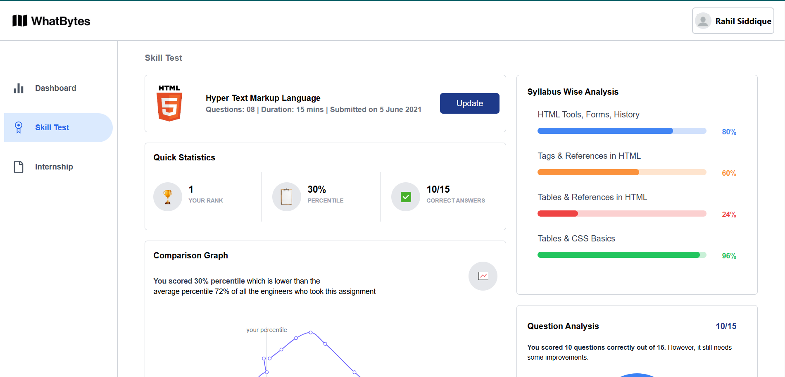
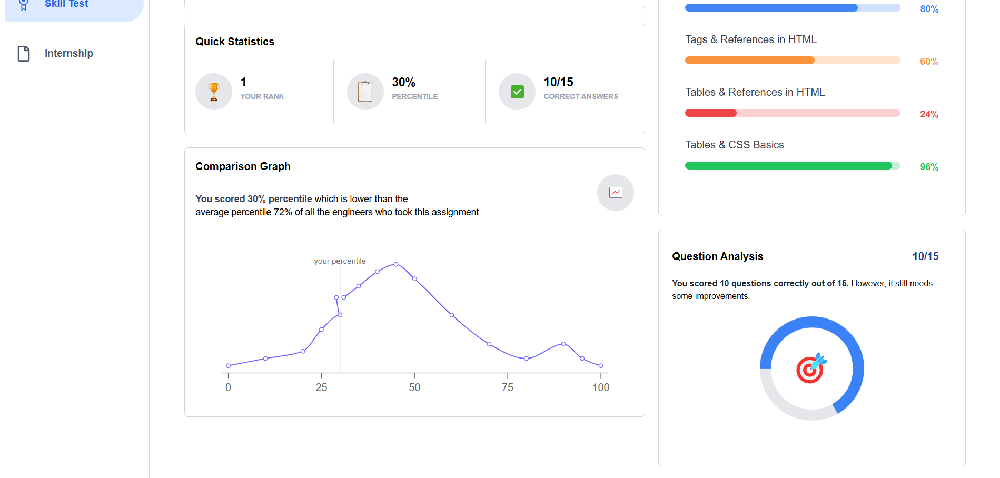
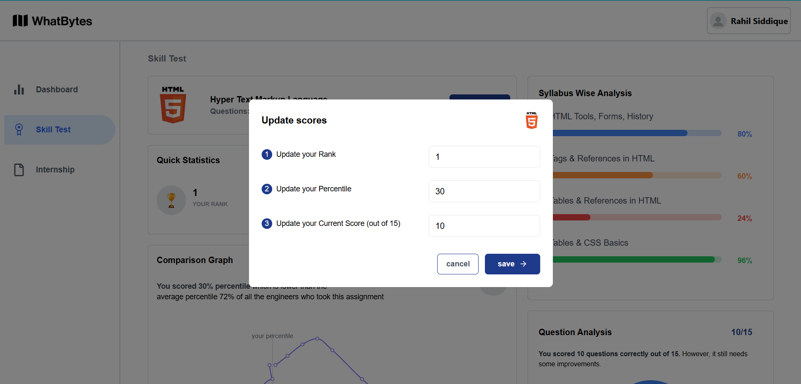
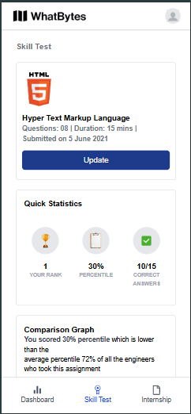
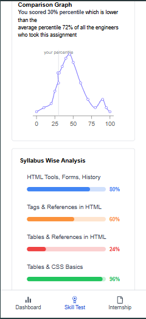
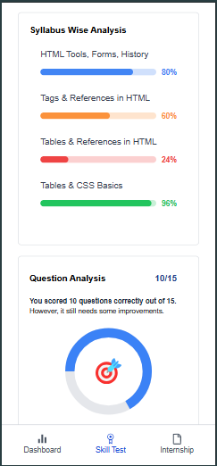
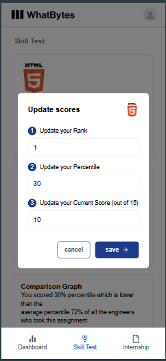

# WhatBytes Assignment

A frontend application created using **Next.js** and **Vite**, designed as a small assignment for WhatBytes. This project includes line graphs and circular progress bars to present data visually, and it is optimized for speed and efficiency. **Redux** is used for efficient state management throughout the application.

## Live Demo

[Check out the live demo here](https://whatbytes435.netlify.app/)

## Features

- **Next.js**: Built using Next.js for server-side rendering, routing, and enhanced performance.
- **Vite**: Leveraged for fast development and optimized production builds.
- **Redux**: Integrated for robust and centralized state management.
- **Data Visualization**:
  - Line graphs powered by [Recharts](https://recharts.org/) for flexible and responsive data displays.
  - Circular progress bars implemented with SVG for smooth and customizable progress indicators.

## Technologies Used

- **Next.js** - A React framework for server-rendered applications.
- **Vite** - A frontend build tool that provides a faster and leaner development experience for modern web projects.
- **Redux** - A predictable state container for JavaScript applications.
- **Recharts** - A composable charting library built on React components.
- **SVG** - Used for creating smooth and customizable circular progress bars.

## Usage

1. Open [http://localhost:5173](http://localhost:5173) in your browser to see the application.
2. Interact with the line graphs and circular progress bars to explore data visualizations.

## Dependencies

1. Next.js
2. React and React-DOM
3. Redux
4. Recharts
5. React-Router-DOM

## Screenshots -> Large Screens

## Screenshots -> Mobile Screens

